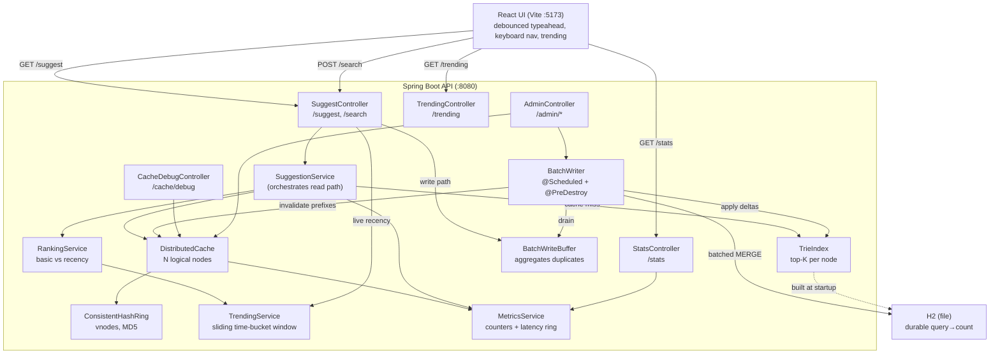

# Architecture

## Component diagram (Mermaid)

## Read path (`GET /suggest`)
1. `SuggestionService` normalizes the prefix (lowercase + trim).
2. `DistributedCache.get(prefix, mode)` → `ConsistentHashRing` picks the owning `CacheNode`.
   - **Hit:** return the cached top‑10 (records a cache hit).
   - **Miss:** `TrieIndex.candidates(prefix)` returns the prefix node's top‑N by count. In recency mode,
     `TrendingService` adds currently‑trending matches; `RankingService` rescores and sorts; the result
     is cached with a mode‑specific TTL.
3. Server‑side latency is recorded for p50/p95.

## Write path (`POST /search`)
1. `BatchWriteBuffer.add(query)` aggregates duplicates in memory.
2. `TrendingService.record(query)` bumps the live recency window immediately.
3. Returns `{"message":"Searched"}` (no DB write on the request path).
4. `BatchWriter` flushes every 2 s / at 500 distinct queries / on shutdown: drain → `TrieIndex.applyDeltas`
   → one JDBC batched `MERGE` into H2 → invalidate affected cache prefixes.

## Layers and why
| Layer | Role | Why |
|---|---|---|
| Distributed cache | hot prefixes, O(1), TTL | low latency; consistent hashing demo |
| Trie index | full dataset, O(prefix len), top‑K per node | fast ranking without subtree scans |
| H2 (file) | durable counts | survives restarts; source for the trie |
| Batch buffer + writer | absorb writes, flush in batches | massively fewer DB writes |
| Trending window | recent activity, decays out | trending + recency ranking |

See [`DESIGN_AND_RATIONALE.md`](DESIGN_AND_RATIONALE.md) for the reasoning, alternatives, and trade‑offs.
